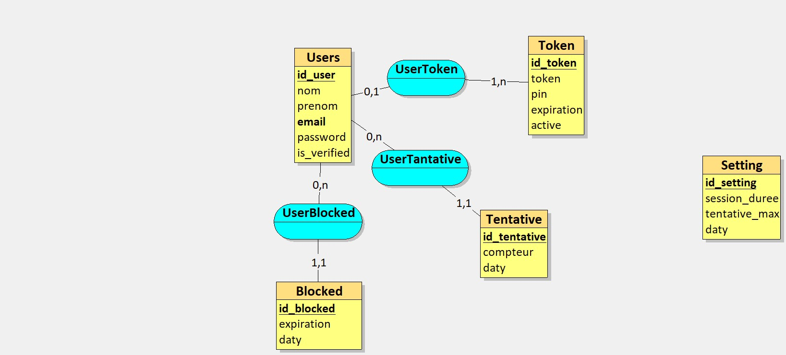

# Auth Project - Spring Boot

## Introduction
Ce projet, **Auth**, est une application Spring Boot conçue pour la gestion de l'authentification. Ce guide vous aidera à installer et à exécuter le projet localement.

---

## Liste des membres
- **Nom et prénom :** SANDRATRINIAVO Tiavina Eric, Ando Fy Aimpenitra, Andriamarohasina Miravo Issa El Nassir ,Andry Malala Nirina Fabio 
- **NumETU :** ETU002643, ETU002365 , ETU002378, ETU002413
- **TODO :** Dans le fichier `TODO`

---

## Prérequis
Assurez-vous d'avoir les éléments suivants installés sur votre machine :

1. **Java** (version 17 ou supérieure)
2. **Maven Wrapper** (fourni avec le projet)
3. **Docker** et **Docker Compose**

---

## Étapes d'installation

### 1. Cloner le dépôt
Clonez le projet à partir de votre dépôt Git :
```bash
git clone <URL_DU_DEPOT>
cd auth
```

### 2. Compilation et création du package (A ignorer)
Utilisez la commande suivante pour nettoyer et construire le projet :
```bash
mvn clean package
```
Cette commande :
- Nettoie les fichiers de construction précédents.
- Compile le code source.
- Génère un fichier JAR exécutable dans le répertoire `target/`.

### 3. Démarrer le projet avec Docker
Utilisez Docker Compose pour lancer le projet et ses dépendances :
```bash
docker compose up -d
```
Cette commande :
- Crée et démarre les conteneurs en mode détaché.
- Vérifie les dépendances spécifiées dans le fichier `docker-compose.yml`.

### 4. Accéder à l'application
Une fois les conteneurs démarrés, l'application est accessible à l'adresse suivante :

[http://localhost:8080/](http://localhost:8080/)

---

## Commandes utiles
- **Arrêter les conteneurs Docker** :
  ```bash
  docker compose down
  ```

- **Vérifier les logs des conteneurs** :
  ```bash
  docker compose logs -f
  ```

---

## Structure du projet

- `src/main/java/` : Contient le code source Java.
- `src/main/resources/` : Fichiers de configuration, y compris `application.properties`.
- `docker-compose.yml` : Fichier de configuration Docker Compose.
- `mvnw` et `mvnw.cmd` : Wrapper Maven pour l'exécution de Maven sans installation préalable.

---

## Modèle Conceptuel de Données (MCD)

Voici le Modèle Conceptuel de Données (MCD) utilisé dans ce projet :



---

## Scénarios d'utilisation de l'API

### User Controller
- **Update User** :
  - **Méthode** : PUT  
  - **URL** : `localhost:8080/api/users/:id`  
  - **Body** :  
    ```json
    {
      "nom": "Eric",
      "prenom": "Nass"
    }
    ```

- **Register User** :
  - **Méthode** : POST  
  - **URL** : `localhost:8080/api/users/register`  
  - **Body** :  
    ```json
    {
      "email": "finaritraantsa@gmail.com",
      "password": "test",
      "nom": "Eric",
      "prenom": "Sandratriniavo"
    }
    ```

- **Vérifier OTP Register** :
  - **Méthode** : POST  
  - **URL** : `localhost:8080/api/users/verify`  
  - **Body** :  
    ```json
    {
      "pin": "205522"
    }
    ```

- **Générer OTP 24 Hours** :
  - **Méthode** : GET  
  - **URL** : `localhost:8080/api/users/pin/:email`  

- **Login** :
  - **Méthode** : POST  
  - **URL** : `localhost:8080/api/users/login`  
  - **Body** :  
    ```json
    {
      "email": "finaritraantsa@gmail.com",
      "password": "test"
    }
    ```

- **Verify Login OTP** :
  - **Méthode** : POST  
  - **URL** : `localhost:8080/api/users/login/otp`  
  - **Body** :  
    ```json
    {
      "pin": "756940"
    }
    ```

- **Get All User** :
  - **Méthode** : GET  
  - **URL** : `localhost:8080/api/users/`

### Setting Controller
- **Get Setting By ID** :
  - **Méthode** : GET  
  - **URL** : `localhost:8080/api/setting/:id`  

- **Update Setting** :
  - **Méthode** : PUT  
  - **URL** : `localhost:8080/api/setting/:id`  
  - **Body** :  
    ```json
    {
      "sessionDuree": 360,
      "tentativeMax": 3
    }
    ```

- **Add Setting** :
  - **Méthode** : POST  
  - **URL** : `localhost:8080/api/setting`  
  - **Body** :  
    ```json
    {
      "sessionDuree": 360,
      "tentativeMax": 3
    }
    ```

- **Get All Setting** :
  - **Méthode** : GET  
  - **URL** : `localhost:8080/api/setting`

### Tentative Controller
- **Réinitialiser Tentative** :
  - **Méthode** : POST  
  - **URL** : `localhost:8080/api/tentative/reinitialise/:idUser`  

- **Valider Réinitialisation** :
  - **Méthode** : POST  
  - **URL** : `localhost:8080/api/tentative/verify`  
  - **Body** :  
    ```json
    {
      "pin": "056579"
    }
    ```

---

## Support
Pour toute question ou assistance, contactez :
- **Email** : eritiavina31@gmail.com
- **Documentation** : Consultez les fichiers internes pour plus d'informations.

---

Merci d'utiliser le projet **Auth** !